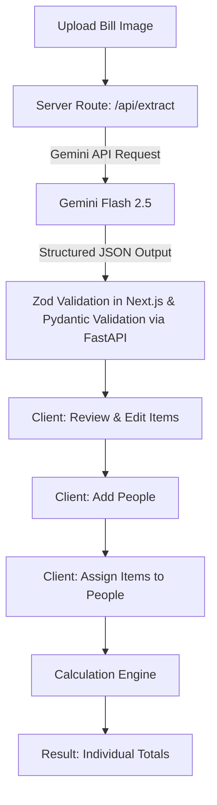

# SplitBill AI

SplitBill AI is an intelligent MVP application designed to remove the hassle of doing math when splitting restaurant bills. 

Instead of manually calculating who owes what, dealing with shared items, and figuring out proportional taxes and service charges, you simply upload a photo of your receipt. The app uses the Gemini multimodal API to extract the line items, taxes, and totals. You then review the data, add your friends, and assign items to individuals or the whole group. The app deterministically calculates each person's exact share, including proportional tax and discounts, without losing a cent to rounding errors.

## Features

- **AI-Powered Extraction**: Upload a photo of your bill, and Gemini extracts all line items, quantities, prices, subtotals, taxes, and discounts.
- **Confidence Indicators**: The AI provides confidence scores. Low confidence fields are flagged for manual review.
- **Editable Review Step**: You are always in control. You can correct the AI's mistakes before any math happens.
- **Smart Assignment**: Assign items to one person, multiple people, or everyone. Shared items are split equally.
- **Proportional Taxes & Discounts**: GST, service charge, and discounts are distributed proportionally based on each person's food consumption.
- **Deterministic Math**: No LLM hallucinations when calculating money. All math is done client-side in pure TypeScript, with robust handling for rounding errors.

## Architecture & Flow



## Tech Stack

- **Framework**: Next.js (App Router)
- **Language**: TypeScript
- **Styling**: Tailwind CSS, Lucide Icons
- **AI**: Google GenAI SDK (`gemini-2.5-flash`)
- **Validation**: Zod
- **Backend/DB**: None! All state is kept client-side during the session.

## Hybrid Validation & Extraction Architecture
To meet strict validation requirements, this project uses a hybrid architecture:
1. **Multimodal Extraction**: Gemini analyzes the uploaded image and extracts the raw structured data.
2. **Pydantic Validation**: The extracted structured data is validated against strict Pydantic models (located in the `backend/` FastAPI microservice).
3. **Deterministic Calculations**: After successful validation, the frontend performs all financial calculations (taxes, discounts, and individual totals) deterministically using pure TypeScript to prevent LLM hallucination on math.

## Proportional Calculation Engine

Our calculation engine ensures fairness and mathematical accuracy:
1. It calculates each person's base "Food Share" by summing the cost of their assigned items (splitting shared items equally).
2. It determines each person's "Ratio" (`Food Share / Total Assigned Food`).
3. It multiplies the total GST, Service Charge, and Discount by each person's Ratio to get their proportional share.
4. It rounds all monetary values to 2 decimal places.
5. It handles rounding gaps (e.g. ₹0.01 differences) by applying the remainder to the first person, ensuring the sum of all individual totals perfectly matches the bill's calculated total.

## Running Locally

1. Clone the repository and install dependencies:
   ```bash
   npm install
   ```

2. Create a `.env.local` file in the root directory and add your Gemini API key:
   ```env
   GEMINI_API_KEY="your_actual_api_key_here"
   ```
   > **Note**: The API key is securely used on the server-side (`/api/extract` route) and is never exposed to the browser.

3. Start the development server:
   ```bash
   npm run dev
   ```

4. Open [http://localhost:3000](http://localhost:3000) in your browser.

## Example Demo Flow
1. Upload a picture of a restaurant receipt.
2. Wait a few seconds for Gemini to analyze the text and return structured line items.
3. Verify the prices and item names. Notice the confidence indicators!
4. Click "Continue to Split", add "Alice" and "Bob".
5. Assign a coffee to Alice, a burger to Bob, and select "Everyone" for the shared fries.
6. Click "Calculate Split" to see exactly how much Alice and Bob each owe, with taxes and service charges distributed perfectly.
